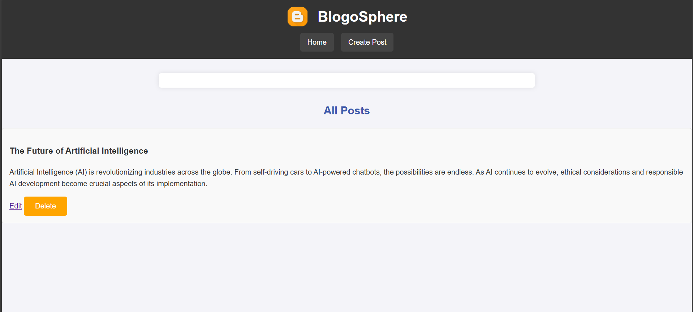
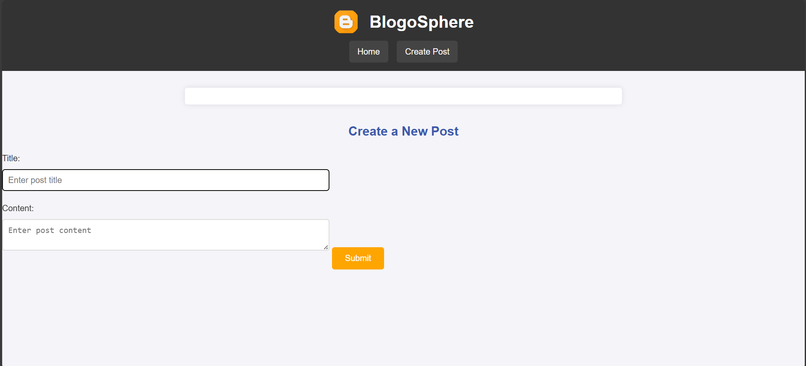

# Blog Application

A simple blog application built using Node.js, Express, and EJS.

## Features
- Create, edit, and delete blog posts
- Uses Express.js for backend
- EJS for templating
- Stores posts in-memory (can be extended to a database)
- User-friendly interface

## Installation

### Prerequisites
Ensure you have the following installed on your system:
- [Node.js](https://nodejs.org/)
- [Git](https://git-scm.com/)

### Steps to Run the Application

1. **Clone the repository**
   
   git clone url
   

2. **Navigate into the project directory**
   
   cd blog-app
   

3. **Install dependencies**
   
   npm install
  

4. **Run the application**
   
   npm start
   

5. **Open your browser and visit:**
   
   http://localhost:3000

## Technologies Used
- Node.js
- Express.js
- EJS (Embedded JavaScript Templates)
- Body-parser
## Screenshots

### Blog App Home Page

### Blog App Post Creation

## License
This project is licensed under the MIT License.

